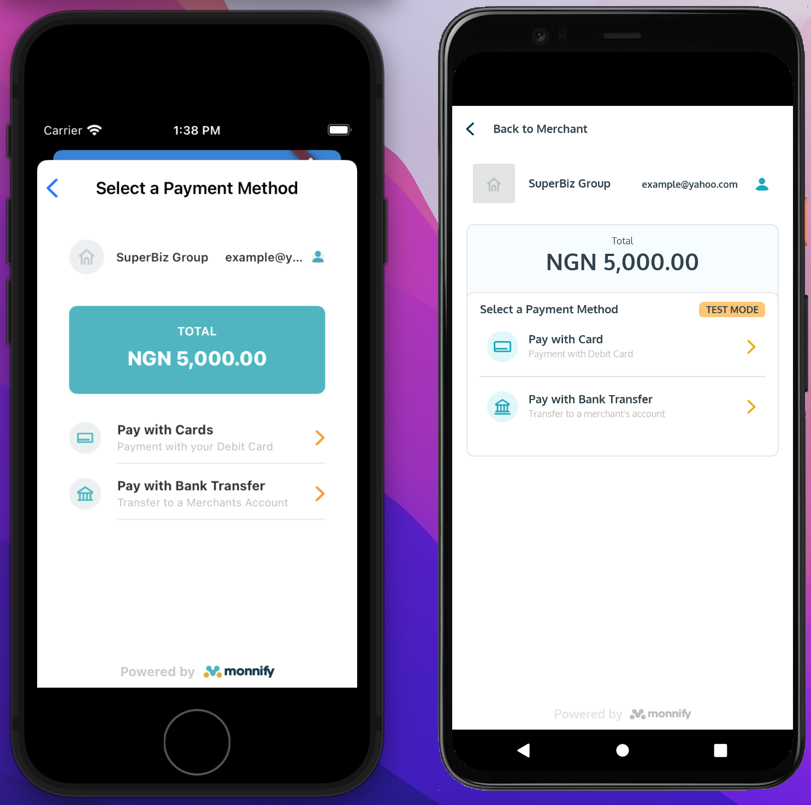

# monnify_flutter

Flutter plugin for Android and iOS Monnify payment gateway


## Getting Started

This project is all about Monnify payment.
It supports both Android and iOS platforms.




:man_technologist: 
## Installation

To use this plugin for payment, add `monnify_flutter` as a 
dependency to your [pubspec.yaml file](https://docs.flutter.dev/development/packages-and-plugins/using-packages)

You can then initialise the plugin preferably in the `initState` method.

```dart
import 'package:monnify_flutter/monnify_flutter.dart';

class MyApp extends StatefulWidget {
  const MyApp({Key? key}) : super(key: key);

  @override
  State<MyApp> createState() => _MyAppState();
}

class _MyAppState extends State<MyApp> {
  final monnify = MonnifyFlutter.instance;
  @override
  void initState() {
    super.initState();
    
    monnify.initializeMonnify(
      ///Enter your API key here from monnify
        apiKey: Hidden.API_KEY,
        ///Enter your contract code here from monnify
        contractCode: Hidden.CONTRACT_CODE,
        applicationMode: ApplicationMode.test);
  }
}
```


:partying_face: 
## Make Payment


You can add this plugin to your flutter application
[here](https://pub.dev/packages/monnify_flutter),
a specialized package that includes platform-specific implementation code for
Android and/or iOS.


